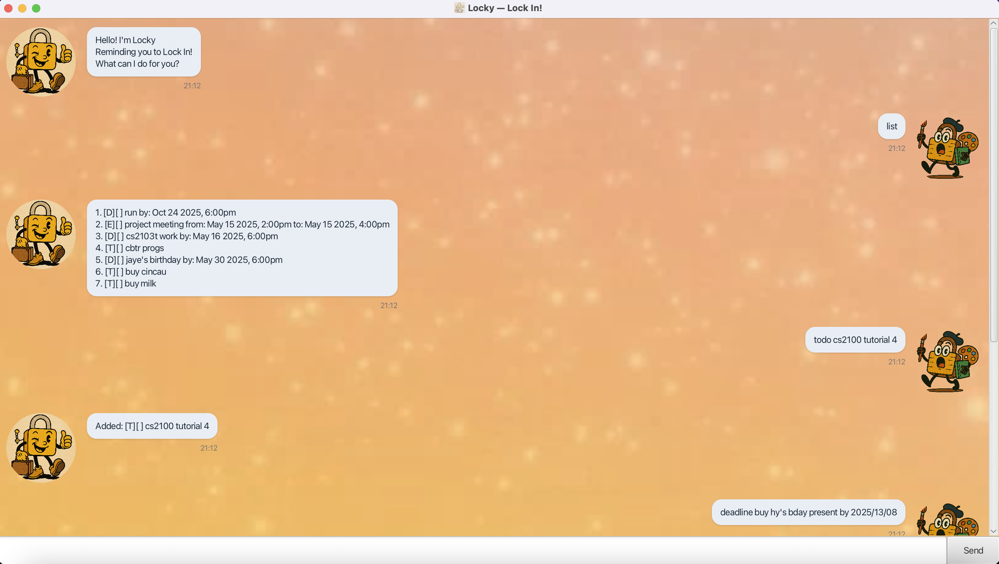

# Locky User Guide



Get ready to Lock In with Locky, your friendly productivity tracker to keep track of your tasks!

## Add Todo tasks
Todo tasks are tasks to check off your todo lists without dates due associated with them.
To make a todo task, simply type

```
todo <description of task>
```

## Adding Deadline tasks
Have an assignment coming up, due 23:59? Locky keeps track of deadlines too, 
where you can input the **description** along with the **deadline** of the task
in **_yyyy-MM-dd HHmm_** format.

```
deadline <description> /by <deadline>
```

## Adding Event tasks
Put events like Jane's Birthday Party to block out entire blocks of time!
Simply input the **description**, along with the **start** and **end** dates in **_yyyy-MM-dd HHmm_** format.

```
event <description> /from <start> /to <end>
```

## List tasks
Locky keeps memory of your existing tasks! See the tasks you created both during and before a 
session.

```
list
```

Expected output:
```
1. [T][ ] make brownies
2. [D][X] send in 2103T by: Aug 29 2025, 4:30pm
3. [E][ ] project meeting from: May 15 2025, 2:00pm to: May 15 2025, 4:00pm
```


## Mark/Unmark tasks
Mark your tasks as done with the mark task.
```
mark <task number>
```
Expected output:
```
Locked In! Task marked as completed:
[D][X] send in 2103T by: Aug 29 2025, 4:30pm
```

Unmark tasks as undone if you decide you're not finished with it yet...
```
unmark <task number>
```
Expected output:
```
Ok, undone. Back to work!
[D][ ] send in 2103T by: Aug 29 2025, 4:30pm
```

## Find tasks
Too many tasks? Look for tasks matching specific keywords!
```
find <keyword>
```
Expected output:
```
command: find cs2103T

1. [D][X] send in 2103T by: Aug 29 2025, 4:30pm
```

## Delete tasks
Too many tasks? Declutter!
```
delete <task number>
```
Expected output:
```
Ok, so let's just forget that task existed...
[D][X] send in 2103T by: Aug 29 2025, 4:30pm
```


// Feature details